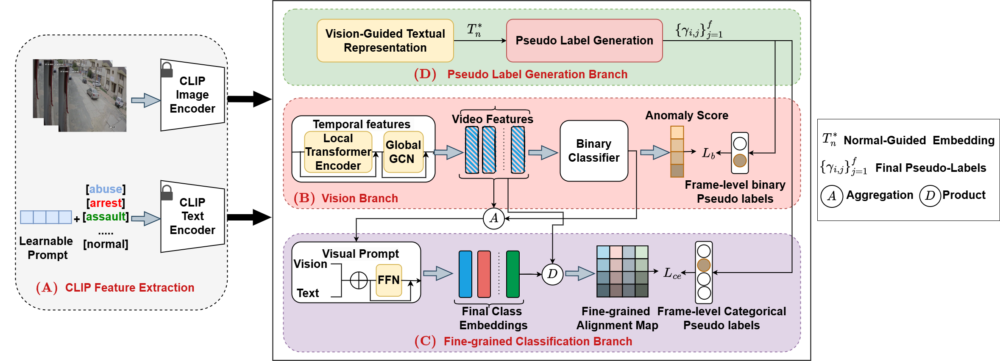

# TFPLG: Training-Free VLM-Based Pseudo Label Generation for Video Anomaly Detection

This repository contains the official implementation of our IEEE Access paper on **Training-Free Pseudo Label Generation (TFPLG)** using vision-language models (CLIP) for Weakly Supervised Video Anomaly Detection (WSVAD).

## 📊 Framework Overview

The figure above illustrates the overall framework of our method, which includes:

- (A) CLIP Feature Extraction for both vision and text modalities.
- (B) Vision Branch for binary classification using a transformer and GCN.
- (C) Fine-grained Classification Branch with visual prompt interaction.
- (D) Pseudo Label Generation Branch that aligns normal-guided textual embeddings with visual features.

---

## 🔧 Setup Instructions

### 1. Feature Preparation

To run or train the model, you will need pre-extracted features:

- **XD-Violence and UCF-Crime features**:  
  Please visit the VADCLIP repository (https://github.com/nwpu-zxr/VadCLIP) and follow their instructions to download:
  - XDTestClipFeatures and XDTrainClipFeatures
  - UCFClipFeatures

- **MSAD features**:  
  You can download them from the following link:  
  [https://1drv.ms/f/c/2341e8a43b5b6eef/Eg7oOKp-0ZJDpPvYbiQOzZ8BrT-lNF0JT48fy_w0RvWNag?e=SoUdUP]

Save all features under a folder named `src/Features/`:

Features/
├── XDTestClipFeatures/
├── XDTrainClipFeatures/
├── UCFClipFeatures/
├── MSADfeatures/

### 2. Pretrained Models

Download our pretrained models from the following link:  
[Insert model download link here]

Save the downloaded model files under:

src/model/

## ✅ Running the Model

### UCF-Crime Evaluation

To test the pretrained model on UCF-Crime:

python ucf_test.py

To train the model from scratch on UCF-Crime:

python ucf_train_80.py

You can configure various training and testing settings by editing the corresponding option files:

- `ucf_option.py` for UCF-Crime
- `xd_option.py` for XD-Violence
- `MSAD_option.py` for MSAD

---

## 🙏 Acknowledgements

We sincerely thank the authors of the VADCLIP repository (https://github.com/nwpu-zxr/VadCLIP) for their excellent codebase, which supported feature extraction and vision-language integration in this work.

---

## 📄 Citation

If you use this code in your research, please cite our paper:

@article{MoshiraTFPLG,
title={Training-Free Pseudo Label Generation for Weakly Supervised Video Anomaly Detection},
author={Moshira, A. and Sajid, j},
journal={IEEE Access},
year={2025},
publisher={IEEE}
}
